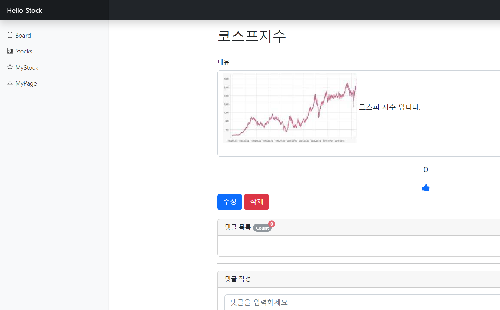
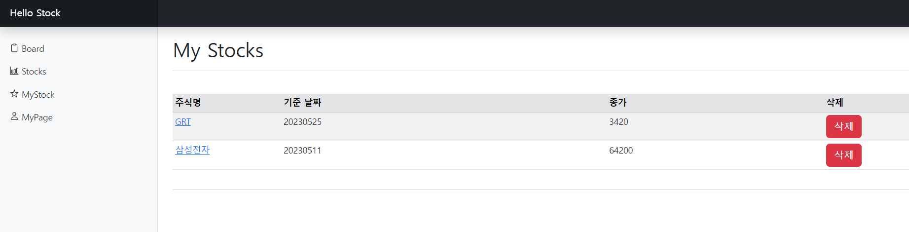

# HelloStock
***
주식 정보 제공과 커뮤니티 기능을 제공하는 웹입니다.

## 주요 기능
***
- 로그인
- 회원가입
- 게시판 
- 댓글
- 주식정보
- 관심주식
- 마이페이지

## 사용도구
***
| spring boot                              | gradle                                   | h2                                    | java11                                 | IntelliJ                                     | Thymeleaf                                      | redis                                   |
|------------------------------------------|------------------------------------------|---------------------------------------|----------------------------------------|----------------------------------------------|------------------------------------------------|-----------------------------------------|
|  |  |       |    |  |  |   |

## DB ERD
***

## 동작 화면
***
### 게시판 화면

### 게시글 작성 화면

### 게시글 확인 화면

### 주식 리스트 화면

### 개별 주식 정보 화면

### 관심 주식 리스트 화면

### 마이페이지 화면

## 추후 추가할 기능
***
- [x] 주식정보 리스트 레디스 적용 조회속도 높이기
- [x] 주식정보에 기사 정보 추가하기
- [ ] 404같은 주요 에러페이지 추가하기
- [ ] 텐서플로우 자바 활용 재미로 보는 주가 예측 추가하기